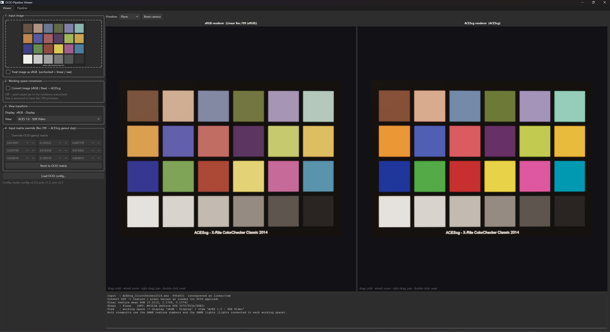
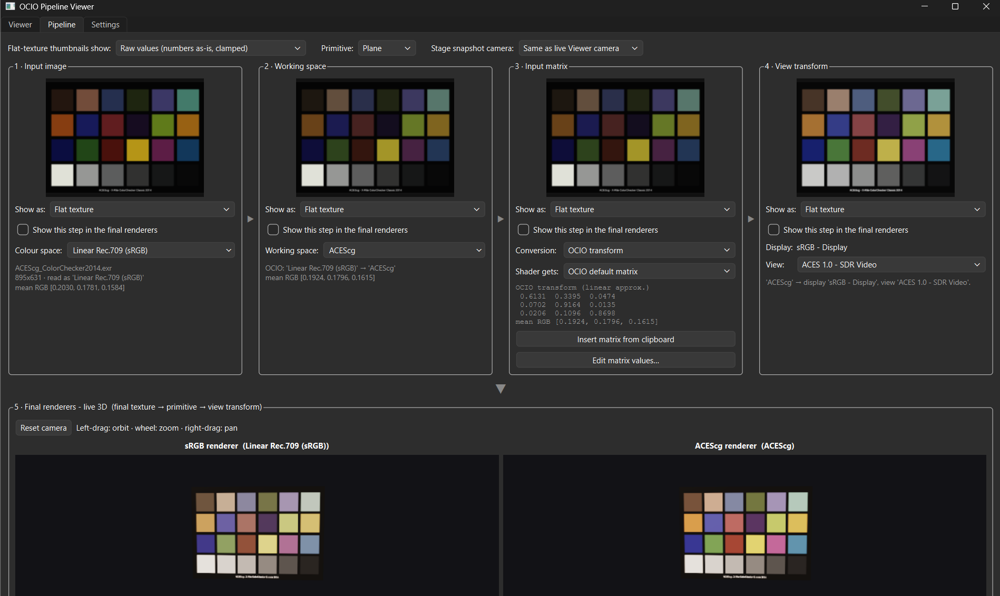

# OCIO Pipeline Viewer
A small Python desktop application for exploring image colour pipelines with OpenColorIO (OCIO).

## Requirements
- Python 3.12

Install the required packages:
```bash
py -3.12 -m pip install PySide6 PyOpenGL opencolorio numpy pillow OpenEXR opencv-python
```

## Run
```bash
py -3.12 ocio_pipeline_viewer.py
```

## Application
### Tabs
 - Viewer   - minimal controls on the left, sRGB and ACEScg 3D realtime viewports on the right.
 
 
 - Pipeline - every conversion step with a thumbnail, with possibility to choose renderer.
 
 
### Viewport controls:
 - left-drag = orbit
 - wheel = zoom
 - right/middle-drag = pan,
 - double-click = reset camera

### Steps to use
 1. Load image (drag & drop / click)   -> interpret as sRGB-encoded or linear/raw
 2. Optional conversion to ACEScg      -> decode to linear Rec.709, then gamut
                                          Rec.709 -> ACEScg (OCIO, or your own 3x3 matrix)
 3. View transform (OCIO display/view) -> applied to both 3D viewports
 4. Select 3D primitive
 5. Observe viewports: an sRGB renderer (Linear Rec.709 working space) and an ACEScg renderer.
	
